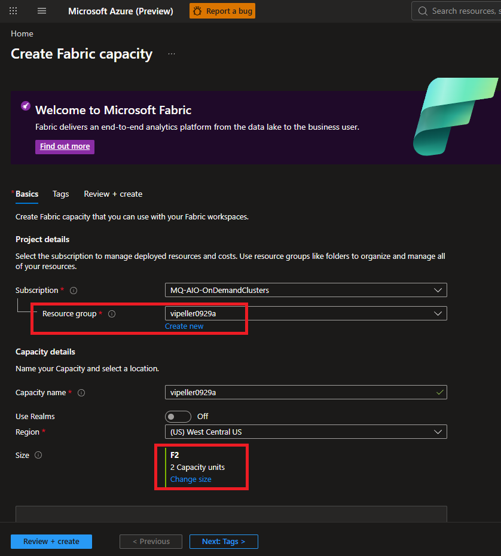
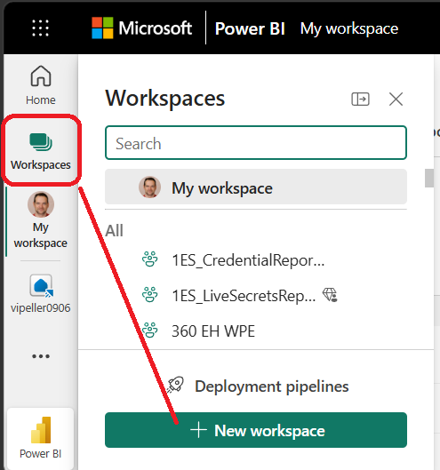
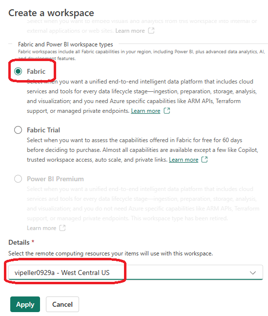
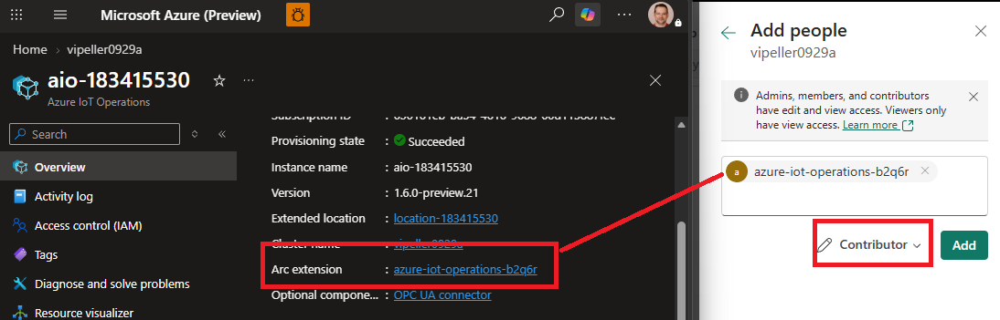
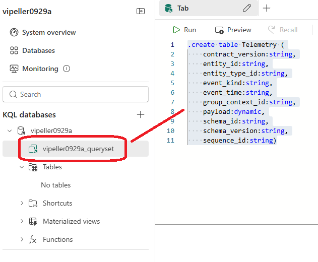
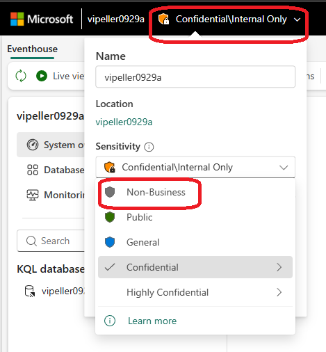
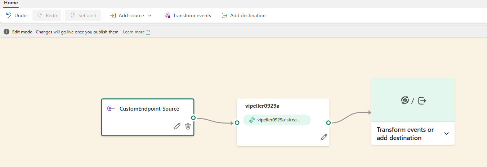
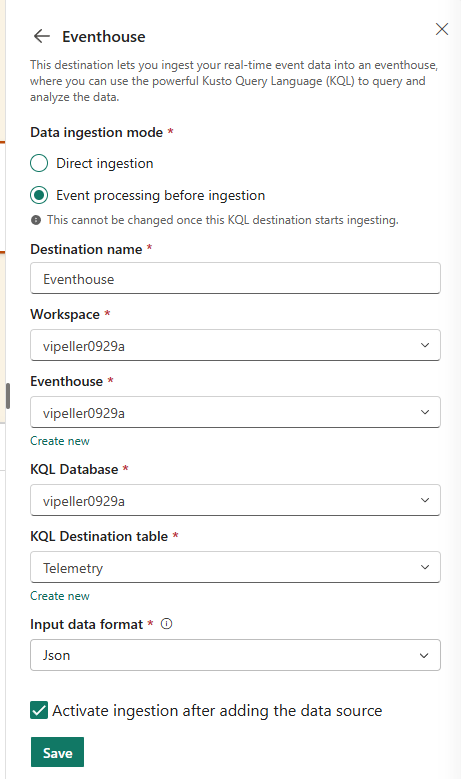
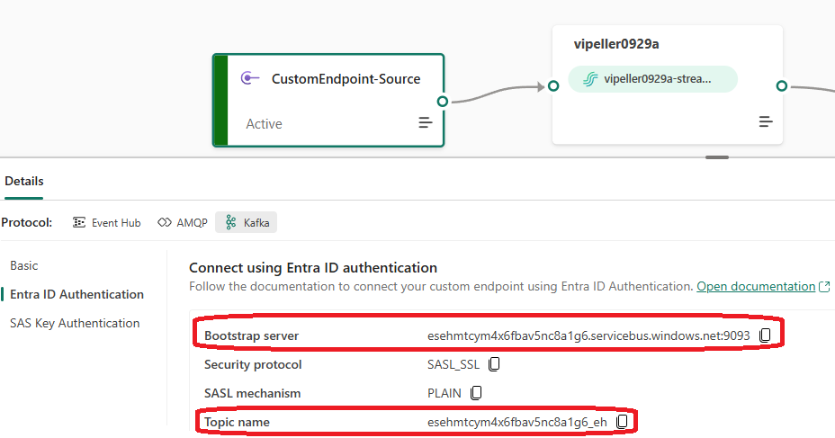

## Quick start

To set up Fabric to receive data from the dataflow:

- Create a Fabric capacity.
- Create a workspace, or assign an existing workspace to that capacity.
- Create an Eventhouse.
- Create a KQL database in the Eventhouse and a table in that database.
- Create an Eventstream to receive data from the dataflow and route it to the table.

### Create a Fabric capacity

[Create a Fabric capacity in the Azure portal](https://ms.portal.azure.com/#create/Microsoft.Fabric).

**Notes:**
- Developers can no longer use the trial subscription for this setup; create a capacity in another subscription.
- Even the smallest capacity can incur significant costs. Delete it when you no longer need it.

1. In the Azure portal, fill out the capacity creation form. If you have an
   on-demand AIO deployment, select its resource group so the capacity is
   removed when the deployment is cleaned up.
2. Set `Size` to `F2`; the default size is significantly more expensive.
3. Review the settings and create the capacity.



### Create a Fabric workspace

1. Open [Power BI](https://msit.powerbi.com/groups/me/list), select `Workspaces`,
   and choose `New workspace`.

   

2. Select `Fabric` as the workspace type, choose the capacity you created, and
   apply the settings.

   

3. In the new workspace, select `Manage access` and add the AIO instance's Arc
   extension as a `Contributor`. You can find the Arc extension's name on the
   AIO instance page in the Azure portal.

   

### Create an Eventhouse and table

1. In the Fabric workspace, select `+ New item`, search for `Eventhouse`, and
   create one. This also creates a KQL database.
2. Open the database and select the item whose name ends in `_queryset` to open
   the query editor.
3. Run the following command to create the `Telemetry` table:

   ```kusto
   .create table Telemetry (
       contract_version:string,
       entity_id:string,
       entity_type_id:string,
       event_kind:string,
       event_time:string,
       group_context_id:string,
       payload:dynamic,
       schema_id:string,
       schema_version:string,
       sequence_id:string)
   ```

   

#### Set the Eventhouse sensitivity

In the Eventhouse, select its name at the top of the page and set `Sensitivity`
to `Non-Business`. This avoids potential permission issues later.



### Create an Eventstream

1. Return to the Fabric workspace, select `+ New item`, and search for
   `Eventstream`.
2. Create the Eventstream **without** selecting `Enable schema-aware eventstream`.
3. Select `Use custom endpoint` from the options in the middle of the screen.
   If those options are not visible, select `Add source` > `Custom endpoint`
   from the toolbar instead.
4. Accept the defaults to create the custom endpoint source. The Eventstream
   canvas should now show the source:

   

#### Add the Eventhouse destination

1. Expand `Transform events or add destination` on the Eventstream canvas and
   select `Add destination`.
2. Select `Eventhouse` from the pane on the right. In the destination form:
   - Select `Event processing before ingestion` as the data ingestion mode.
   - Choose the workspace, Eventhouse, and KQL database you created earlier.
   - Select `Telemetry` as the `KQL Destination table`.
   - Set `Input data format` to `Json` and leave
     `Activate ingestion after adding the data source` checked.

   

3. Select `Save`, then select `Publish` in the upper-right corner to apply the
   Eventstream configuration.

#### Save the connection details for the dataflow

1. On the Eventstream canvas, select the `CustomEndpoint-Source` box.
2. In the details pane below, select `Kafka` under `Protocol`, then select
   `Entra ID Authentication`.
3. Note the `Bootstrap server` and `Topic name` values. You will need them when
   configuring the dataflow, but you can also return here to retrieve them later.



**DON'T FORGET** to set the sensitivity label to non-business, otherwise dataflow will receive
authentication/permission errors.

[Back](README.md)
